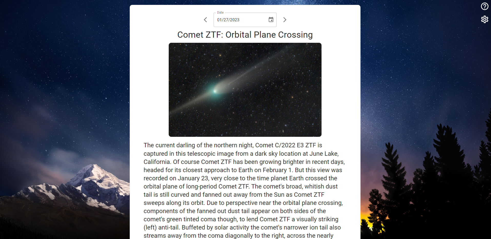
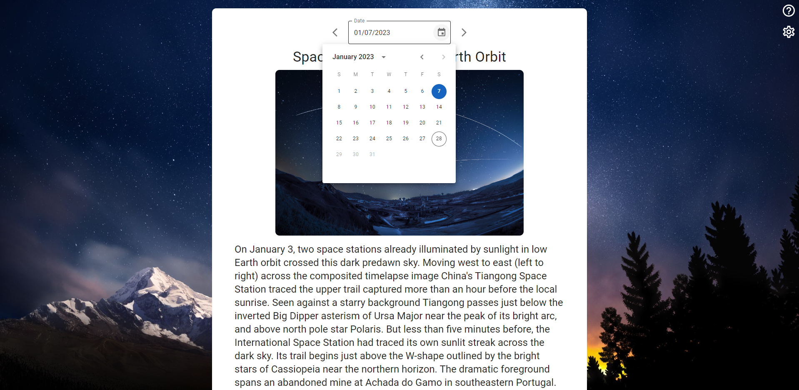
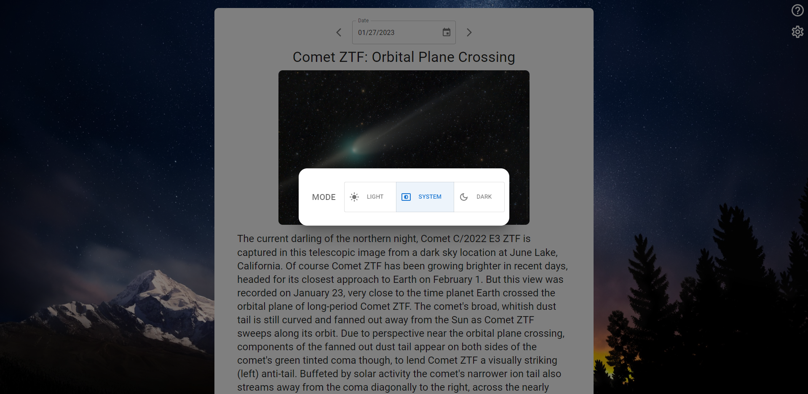
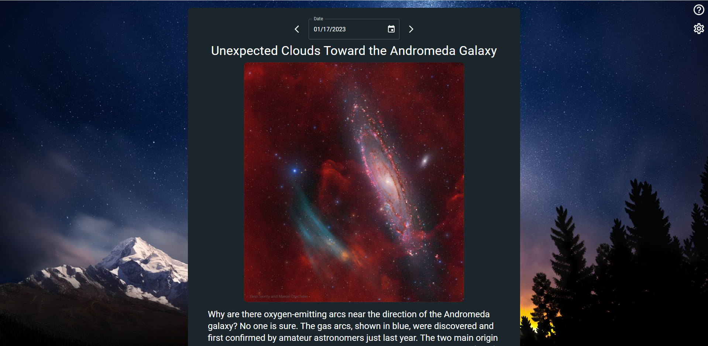

# Space Pictures

Space Pictures is a website dedicated to showcasing the beauty and wonder of the universe. 
The website uses a free API provided by NASA, specifically the https://api.nasa.gov/ and the Astronomy Picture of the Day website to fetch new 
and exciting pictures of space. Every day, a new stunning image of space is featured, accompanied by informative text about the subject of the picture. 
Users can switch between a dark and light theme, making it easy to enjoy the site day or night. Explore galaxies, nebulae, and other celestial objects, 
and learn about the latest space discoveries and research. Space Pictures offers an out-of-this-world experience for anyone interested in space and astronomy.

### <a href="" target="_blank">Go to the Space Pictures!</a>

---
## Technologies  
- React JS  
- React Query
- Material UI
- API provided by NASA <a href="https://api.nasa.gov/" target="_blank">NASA Open APIs</a>
---

## Interface

## Date Selection

## Settings

## DarkMode

